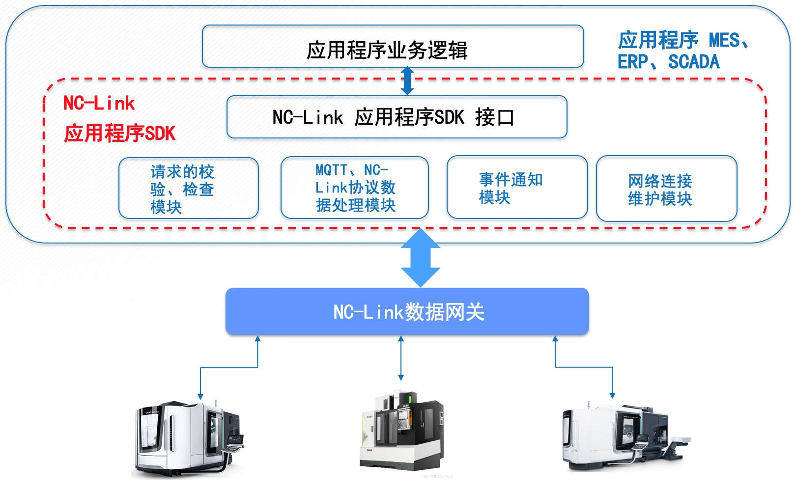

# NC-Link Client SDK 接口设计文档

## 1 SDK设计目的
本SDK介于NC-Link工业互联网互联互通标准协议中定义的应用层与NC-Link数据层之间，设计目的是为加快NC-Link相关应用软件从网络边缘数控装备取数据的协议交互开发过程，旨在隐藏NC-Link协议及MQTT协议底层细节，封装相关取数业务逻辑，形成一套功能完善、定义清晰、组成稳定、使用方便的API。

## 2 SDK总体结构
本SDK封装了以下几个模块：

1. 请求的校验、检查模块
2. MQTT、NC-Link协议数据模块
3. 事件通知模块
4. 网络连接维护模块

SDK实现的总体架构如下：

## 2 各子模块功能划分
### 2.1 请求的校验、检查模块
本模块对SDK发出的各种网络请求报文进行基本的合法性检查，在客户端对非法请求进行拦截过滤，降低数据源处理压力，并形成日志输出方便调试。

### 2.2 MQTT、NC-Link协议数据模块
本模块集成了MQTT与NC-Link协议的各种交互过程，以在SDK内部消化协议交互细节，对外提供方便简洁的API进行调用，避免协议的繁琐交互逻辑对SDK用户造成不必要的学习成本。

### 2.3 事件通知模块
本模块实现了事件通知功能，可以在指定事件发生时，触发相关操作或输出。具体可以设定的事件类型及关联操作类型请见《NC-Link Client SDK事件通知模块设计文档》

### 2.4 网络连接维护模块
本模块集成了MQTT与NC-Link协议相关的网络连接各环节状态维护、调试输出等网络底层支持。

## 3 业务逻辑与模块交互流程
## 4 技术指标
### 4.1 支持的平台架构与编程语言
本SDK同时提供以下多个版本，均可跨平台开发：

| 语言 | 支持的运行环境 | 支持的最低版本 |
| :-: | :-: | :-: |
| C# | .NET Core (跨平台) | 3.1 |
| Python | CPython（跨平台） | 3.7 |
| JavaScript | NodeJS（跨平台） | 10.0 |

### 4.2 性能需求
本SDK支持1000+高并发取数据请求，同时维持毫秒级低响应时间。测试结果如下图所示。

### 4.3 稳定性需求
稳定性方面，本SDK在支持的API范围内，充分测试各种应用环境，达到7*24全天候运行标准。

### 4.4 兼容性需求
本SDK通过支持多种跨平台语音，可兼容各种常见软硬件环境。

